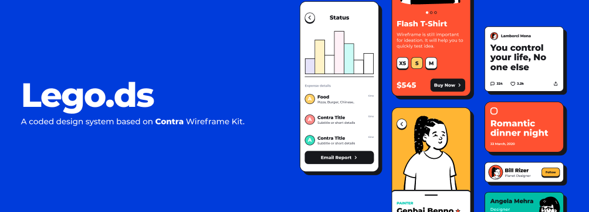

# Lego Design System - iOS

Toda vez que explicamos Design System usamos como exemplo as famosas peças de Lego, pois qualquer criança no mundo consegue
unir facilmente as peças e criar diferentes construções de acordo com sua criatividade.

> Um Design System é justamente isso! um conjunto de componentes prontos para que qualquer desenvolvedor ou designer consiga
criar apps incriveis de acordo com sua criatividade!

**Pensando nisso, seu objetivo é criar um Design System do zero! chamado de Lego.DS** :iphone: 

## Calma, vamos te ajudar com isso!

Deixamos para você um projeto no **Figma** com tudo que você precisa para criar seus componentes, lá você vai encontrar a paleta de cores, fontes, icones,
ilustrações, handoff (especificação de design) dos componentes e também um modelo sugerido para o seu sample-app. :iphone:

https://www.figma.com/file/KaBWI7Bdi6npuOjPDmhBTm/Design-System?node-id=387%3A8246

 

---------

 

## Neste desafio você deverá:

- [x] **Desenvolver de 1 a 3 componentes** seguindo o layout de HandOff do Figma. (Fique a vontade para escolher)

- [x] **Documentar** a implementação (uso) dos **componentes que você codou** de acordo com o [modelo de exemplo](https://github.com/victormath12/lego-design-system/blob/main/ios/modelo-documentacao/button.md)

 

## Requisitos Essenciais

- [x] Usar Swift 5.

- [x] Interface no Storyboard usando Auto Layout.

- [x] Testes unitários nos componentes. (sem coverage mínimo, apenas se preocupe em testar o que você julga ser necessário) :clipboard:

 

## Você se destacará se:

- [ ] Desenvolver um **sample-app simples** para demonstrar o funcionamento dos componentes codados. (No figma deixamos uma **sugestão** de layout)

- [ ] Reaproveitar propriedades de estilo (cores, fontes, espaçamentos) entre componentes. 

- [ ] Desenvolver utilizando as melhores práticas de acessibilidade.

- [ ] Construir Testes de interface ou pixel-perfect.

- [ ] Integração com fastlane para cobertura :bar_chart: de testes.

- [ ] Modularizar componentes para serem utilizados por outros apps.

 

## Observações

- [x] Deixamos componentes com diversos níveis de complexidade, se você não conseguir desenvolver algum dos componentes não tem problema! 
O importante é você nos mostrar até onde conseguiu chegar e qual é o seu estilo de codificação.

- [x] Não se preocupe em deployar seu sample-app em uma loja de aplicativos... Invista seu tempo em construir, testar e documentar seus componentes da melhor forma!

- [x] Na construção do sample-app você decide se utilizará roteamento (multi-telas) ou se o app terá uma única tela com todos os exemplos de componentes.

- [x] Buscamos um código bem simples, organizado e que se preocupe com o alto desempenho :chart_with_downwards_trend:.

- [x] Fique a vontade :point_up: para usar quantas bibliotecas quiser ou design-patterns que você achar pertinente em sua solução. 
Estamos interessados em saber se você está atualizado com as melhores práticas em desenvolvimento iOS. 
